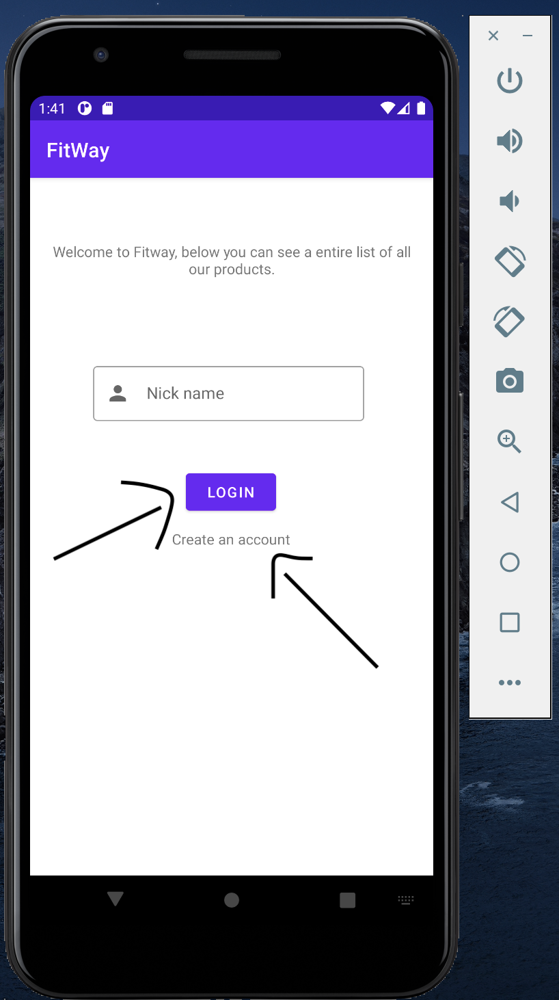

# Bienvenido al mvp no lanzable de fitway!

Para iniciar fitway copia este repositorio y abre el proyecto a traves de Android Studio.

## Flujo.

1. La aplicación es 100% Local y empieza en una vista de Login, donde para hacer las cosas simples los usuarios se indentifican por el campo nicename.   
Que es de caracted unico e irrepetible.

Dentro de esta vista podemos encontrar 2 accionables. El boton de **LOGIN** que valida si el usuario existe y que rol tiene dentro de la aplicación. Y el texto accionable **Create an account** el que se encarga de redirigir al usuario, a la pantalla de registro.

Al clickear en **Create an Account** llegamos a la siguiente vista:

En esta vista se recopilan todos los datos del usuario. Pero especialmente, el usuario puede escoger que rol va a cumplir dentro de la aplicaición.

### Flujo por roles.
Despues de tener en conocimiento estas 2 vistas tenemos que los usuarios pueden tener roles, definidos. por ello ya sea en la vista de **Login** on el la vista de **Registro**, al clickear en su CTA. Tenemos 2 caminos:

### ROL USUARIO.

Para los usuarios la vista principal esta basada en un RecyclerView, que muestra una lista de instancias el objeto **Producto.** con un accionable que es un botón que lleva a una vista de agradecimiento por realizar la compra.

La vista anteriormente mostrada es una vista informativa con un boton de seguir comprando.

### ROL ADMINISTRADOR.

Para el rol administrador todo es un poco más sencillo pues en su pagina principal solo cuenta con un botón que le permite añadir productos.

Al accionar el boton (+):

**NOTA:** El App viene sin datos entonces para este MVP el flujo sugerido es primero intentar una cuenta de administrador, para añadir productos y luego probar la navegación del usuario.

## OPORTUNIDADES DE MEJORA:

* Agregar toast para notificar errores de manera mas intuitiva.
* Añadir validaciones a los campos.
* Añadir carrito de compras.
* Algunos de los campos y tablas de la base de datos no fueron utilizados a cabalidad por cuestión de timepo. Pero pertenecen a la expectativa de la funcionalidad final de la misma.

Presentado por:  
Sebastian Bárcenas.
sbarcenas00@gmail.com - sbarcenas@sophilabs.com
+57 3003140528  

